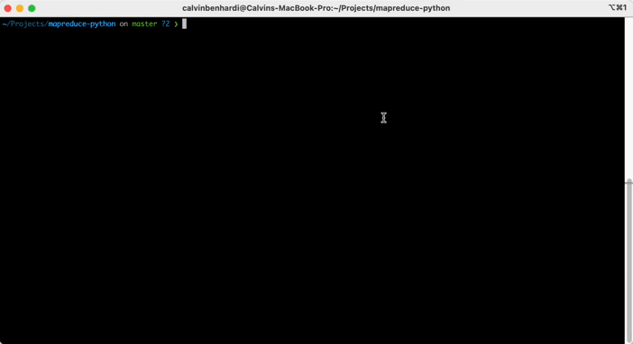

# MapReduce in Python

Welcome to the MapReduce in Python project repository.

# Getting Started

1. Clone the repository

   ```
   git clone git@github.com:calvinbenhardi/mapreduce-python.git
   ```
2. Run the code

   ```
   docker compose up
   ```

   

# Code Structure

1. **services/csv_loader.py** Contains the CSVLoader class to load data.csv
2. **services/mapper.py** Contains Mapper class to convert data.csv items to tuple (string, count = 1)
3. **services/reducer.py** Contains Reduces class to sort, iterate and reduce (apply sum of count)
